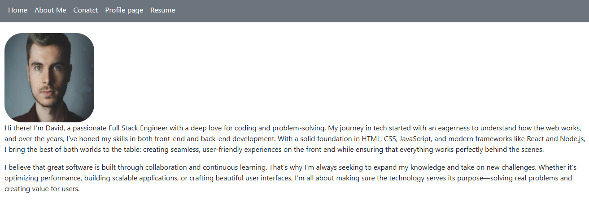

# React + Vite

Developer Portfolio

#Table of Contents

Description
Features
Technologies Used
Installation
Usage
Screenshots
Deployment
Contact

#Description
This is a single-page application (SPA) portfolio built using React. It showcases the developer’s projects, skills, and resume while providing easy navigation between different sections. The site is fully responsive and offers interactive elements such as a contact form with validation and dynamically highlighted navigation links.

#Features

✅ Navigation:
The navigation bar includes links to About Me, Portfolio, Contact, and Resume sections.
The current section is highlighted dynamically.

✅ About Me Section:
Displays a recent photo/avatar of the developer.
Includes a short biography.

✅ Portfolio Section:
Showcases six applications with titles, images, and links to both the live demo and GitHub repository.

✅ Contact Section:
Includes a contact form with fields for Name, Email, and Message.
Displays validation errors if required fields are left empty or an invalid email format is entered.

✅ Resume Section:
Provides a downloadable resume.
Lists my technical proficiencies.

✅ Social Links:
Includes links to GitHub, Netlify

#Technologies Used

React.js – For building the single-page application.
React Router – For client-side routing and navigation.
CSS/Bootstrap – For styling and responsiveness.
Form Validation – Ensures proper data entry in the contact form.

#Installation
To run this project locally, follow these steps:

1.Clone the Repository: https://github.com/DavidSwider/David-s-Portfolio.git

2.git clone: https://github.com/DavidSwider/David-s-Portfolio.git

cd Davidsportfolio

3.Install Dependencies:

npm install

4.Build the Application: 

npm run build

5.Start the Development Server:

npm run dev

6.Open http://localhost:3000/ in your browser.

#Usage

Click on navigation links to explore different sections.

View projects, download the resume, and contact the developer.

Submit the contact form with valid inputs.

#Screenshots

#Deployment

The portfolio is deployed online at:

🔗 Live Portfolio: https://davidsportfolio1.netlify.app/

Github repository: https://github.com/DavidSwider/David-s-Portfolio

#Contact
📧 Email: Davidswider6@gmail.com
🔗 GitHub: https://github.com/DavidSwider
🔗 Netlify: https://davidsportfolio1.netlify.app/

This template provides a minimal setup to get React working in Vite with HMR and some ESLint rules.

Currently, two official plugins are available:

- [@vitejs/plugin-react](https://github.com/vitejs/vite-plugin-react/blob/main/packages/plugin-react/README.md) uses [Babel](https://babeljs.io/) for Fast Refresh
- [@vitejs/plugin-react-swc](https://github.com/vitejs/vite-plugin-react-swc) uses [SWC](https://swc.rs/) for Fast Refresh

## Expanding the ESLint configuration

If you are developing a production application, we recommend using TypeScript and enable type-aware lint rules. Check out the [TS template](https://github.com/vitejs/vite/tree/main/packages/create-vite/template-react-ts) to integrate TypeScript and [`typescript-eslint`](https://typescript-eslint.io) in your project.

License
This project is licensed under the MIT License.